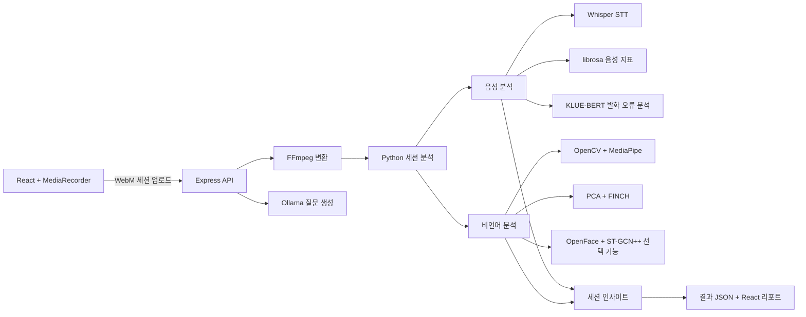

# G.T.A

> AI 면접 연습 및 표현 습관 분석 시스템

G.T.A는 사용자의 답변 영상과 음성을 함께 분석해 **답변 내용, 말하기 습관, 시선·표정·자세 패턴**에 대한 피드백을 제공하는 캡스톤 프로젝트입니다. 사용자가 연습 주제를 선택하면 로컬 LLM이 세 개의 질문을 생성하고, 브라우저에서 녹화한 답변을 분석해 발화와 행동 변화가 나타난 구간을 웹 리포트로 보여줍니다.

현재 저장소는 로컬 환경에서 실행하는 단일 사용자 프로토타입입니다.

## 주요 기능

| 기능 | 설명 |
| --- | --- |
| 상황별 질문 생성 | 취업 면접, 발표, 피치 등 사용자 주제에 맞춰 Ollama 기반 LLM이 질문 세 개를 생성합니다. |
| 음성 분석 | Whisper로 한국어 답변을 전사하고, 말 속도·침묵 시간·추임새·반복·발화 오류를 분석합니다. |
| 비언어 분석 | MediaPipe와 OpenCV로 얼굴·포즈·손 랜드마크를 추출하고 시선, 표정, 머리 움직임과 자세 패턴을 분석합니다. OpenFace와 ST-GCN++도 선택적으로 연결할 수 있습니다. |
| 행동 패턴 군집화 | 정규화한 특징 벡터를 PCA로 축소하고 FINCH로 유사한 행동 패턴을 자동 군집화합니다. |
| 세션 흐름 분석 | Whisper 발화 구간과 비언어 상태 타임라인을 연결해 긴장 상승, 자신감 변화와 피드백 후보 구간을 찾습니다. |
| 결과 리포트 | 답변 시간, 말 속도, 추임새, 행동 변화 구간과 반복 습관 후보를 React 대시보드에서 확인할 수 있습니다. |

## 분석 흐름



비언어 분석은 클러스터의 분리 품질과 얼굴·머리 자세 측정 신뢰도를 함께 계산합니다. 신뢰도가 낮은 항목은 강한 근거로 사용하지 않도록 제한하며, 최근 세션의 반복 신호를 별도 습관 후보로 정리합니다.

## 기술 스택

- Frontend: React, Vite, Tailwind CSS
- API / Media: Node.js, Express, FFmpeg
- Analysis: Python
- Speech: OpenAI Whisper, librosa, sounddevice, KLUE-BERT
- Vision: OpenCV, MediaPipe Holistic, OpenFace, ST-GCN++(선택 기능)
- Modeling: scikit-learn PCA, FINCH clustering, MMAction2(선택 기능)
- Local LLM: Ollama, EXAONE 3.5, Qwen 3

## 프로젝트 구조

```text
.
├── gta-frontend/              # React UI와 Express 중계 서버
├── behavior_grouping/         # 랜드마크 추출, 군집화, 얼굴·행동 분석
├── verbal_synthesis/          # 녹음, STT, 언어 분석, LLM 연동
├── training/                  # 머뭇거림 탐지 모델 학습·추론 도구
├── analyze_uploaded_session.py  # 업로드 세션 통합 분석 파이프라인
├── session_insights.py        # 발화·행동 타임라인 및 습관 후보 생성
├── orchestrator.py            # 카메라·마이크 기반 레거시 실행 흐름
├── analyze_uploaded_video.py  # OpenFace·ST-GCN++ 영상 분석 CLI
└── requirements.txt           # Python 실행 의존성
```

## 로컬 실행

### 사전 요구 사항

- Python 3.10 권장
- Node.js 18 이상
- 카메라와 마이크를 지원하는 Chrome 또는 Edge
- [FFmpeg](https://ffmpeg.org/)
- [Ollama](https://ollama.com/)

### 1. 저장소 및 Python 환경 준비

```bash
git clone https://github.com/Namneul/CapStoneProject.git
cd CapStoneProject

python3 -m venv .venv
source .venv/bin/activate       # macOS / Linux
# .venv\Scripts\activate      # Windows PowerShell

python -m pip install -r requirements.txt
```

### 2. 프론트엔드 설치

```bash
cd gta-frontend
npm install
cd ..
```

### 3. 로컬 LLM 준비

```bash
ollama pull exaone3.5:7.8b
ollama pull qwen3:8b
ollama serve
```

EXAONE은 질문 생성과 기존 통합 흐름에, Qwen은 업로드 세션의 전달 방식 피드백에 사용됩니다. Ollama가 이미 백그라운드에서 실행 중이라면 `ollama serve`는 생략할 수 있습니다.

### 4. 웹 애플리케이션 실행

```bash
cd gta-frontend
npm run dev:all
```

브라우저에서 `https://localhost:5173`에 접속합니다. 개발용 자체 서명 인증서 경고가 나타나면 로컬 접속을 허용하고 카메라·마이크 권한을 승인합니다. 세 문항의 답변을 마치면 브라우저 녹화본이 서버로 전송되며, 결과는 `result/final_result.json`에도 저장됩니다.

저장된 영상 파일을 CLI에서 분석하려면 다음 명령을 사용할 수 있습니다.

```bash
python analyze_uploaded_session.py sample.mp4 \
  --question "지원 동기와 관련 경험을 설명해 주세요." \
  --situation "취업 면접" \
  --output-dir result/uploaded_session
```

## 선택 기능

### KLUE-BERT 언어 분석

AI Hub 기반 TensorFlow KLUE-BERT 모델은 저장소에 포함되어 있지 않습니다. 기본 경로는 다음과 같습니다.

```text
models/1.모델/2.AI학습모델파일/모델1_언어적_KLUE-BERT/
```

다른 위치의 모델을 사용할 때는 `KLUE_BERT_MODEL_DIR` 환경변수를 지정합니다. 모델이 없으면 관련 분석을 비활성화한 채 나머지 파이프라인은 계속 실행됩니다.

### OpenFace 및 ST-GCN++ 영상 분석

OpenFace의 `FeatureExtraction` 실행 파일을 설치한 뒤 경로를 지정합니다.

```bash
export OPENFACE_FEATURE_EXTRACTION_BIN=/path/to/FeatureExtraction
python analyze_uploaded_video.py sample.mp4 --output-dir result/uploaded
```

결과는 지정한 출력 폴더의 `analysis_result.json`에 저장됩니다.

ST-GCN++는 AI Hub 체크포인트와 MMAction2 실행 환경이 모두 있을 때 활성화됩니다. 모델 파일이나 선택 의존성이 없으면 해당 분석만 `unavailable`로 표시되고 기본 MediaPipe 파이프라인은 계속 실행됩니다.

## 검증

프론트엔드 빌드와 비언어 분석 파이프라인의 스모크 테스트는 다음 명령으로 확인할 수 있습니다.

```bash
cd gta-frontend && npm run build
cd ..
python behavior_grouping/test_pipeline.py
```

## 현재 범위와 개선 계획

- 결과와 현재 세션이 고정된 로컬 경로에 저장되므로 단일 사용자 실행을 전제로 합니다.
- 로그인·회원가입 화면은 UI 프로토타입이며 실제 인증과 사용자별 데이터 분리는 아직 구현하지 않았습니다.
- 결과 화면의 종합 점수와 실시간 경고는 임시 값이며, 실제 분석 지표와 연결할 예정입니다.
- 모델 파일과 평가용 데이터셋은 용량 및 라이선스 문제로 저장소에 포함하지 않습니다.

## 개인정보 및 활용 안내

분석 과정에서 녹음 파일, 대표 프레임과 JSON 결과가 로컬에 생성될 수 있습니다. 실제 사용자 데이터를 사용할 때는 사전 동의를 받고 결과물을 공개 저장소에 올리지 않도록 주의해야 합니다. 본 프로젝트의 분석 결과는 연습을 위한 참고 정보이며 채용, 의료 또는 심리 진단의 근거로 사용해서는 안 됩니다.
